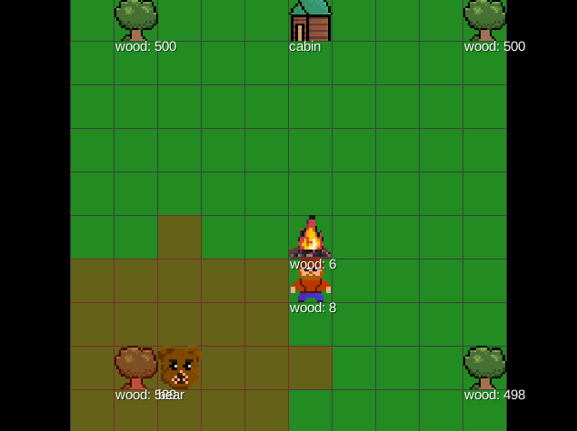
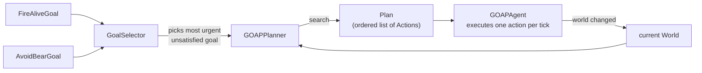
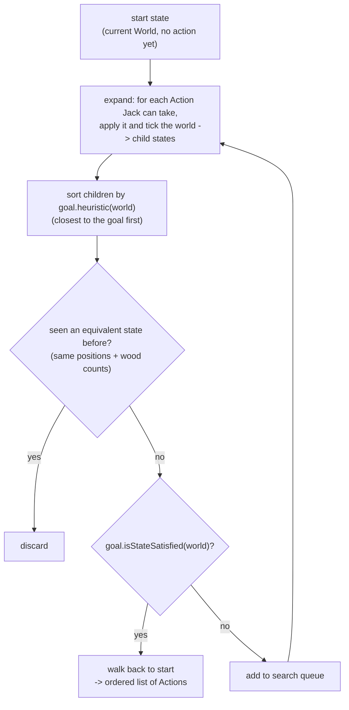

# HelpJack

HelpJack is a small [libGDX](https://libgdx.com/)/Kotlin game about survival — and a playground for  
comparing game-AI decision-making techniques on the same problem.

Jack lives in the woods with a cabin, a campfire, and a bunch of trees. He needs to chop wood and  
feed the campfire to keep it alive, while a bear roams the map looking for him. If the bear catches  
Jack out in the open, it's game over; hiding in the cabin keeps him safe.

The interesting part isn't the survival loop itself — it's that Jack's (and the bear's) behavior can  
be driven by any of several interchangeable AI architectures, all built from scratch in `core`:

- **`HumanAgent`** — keyboard control (arrow keys), for playing a character directly.
- **`RandomAgent`** / **`DoNothingAgent`** — trivial baselines.
- **`TaskListAgent`** — runs a fixed, hand-authored sequence of `Task`s (e.g. go to a tree, collect  
wood, go to the fire, burn wood).
- **`BehaviorTreeAgent`** — classic behavior tree built from composable nodes (`Selector`,  
`Sequence`, `Guard`, `Wander`, `SeekActor`, `IsJackInSight`), used by the bear to hunt Jack when  
it sees him and wander otherwise.
- **`GOAPAgent`** — Goal-Oriented Action Planning: picks a goal (`FireAliveGoal`, `AvoidBearGoal`)  
via a `GoalSelector` and asks `GOAPPlanner` for a plan of `Action`s to reach it, replanning when  
the world changes (e.g. the bear gets too close).
- **Decorators** — `ReactionTimeAgent` throttles how often an underlying agent is allowed to act  
(simulating reaction delay), and `SwitcherAgent` swaps between agents based on conditions.

By default (`FirstScreen`), Jack is controlled by a `GOAPAgent` wrapped in a `ReactionTimeAgent`,  
and the bear by a `HumanAgent`, but any agent can be dropped in for either actor — see  
`agent/CommonAgents.kt` for ready-made combinations.

## Controls

Arrow keys move whichever actor is currently wired to a `HumanAgent` (the bear, by default).

## How GOAP planning works

GOAP treats "what should I do next" as a search problem instead of a hand-scripted rule tree.
Each `Goal` (`FireAliveGoal`, `AvoidBearGoal`) can say whether it's already satisfied, how urgently
it wants to run (`getWeight`), and how close the world is to satisfying it (`heuristic`). The
`GoalSelector` picks the most urgent unsatisfied goal, and `GOAPPlanner` searches for a sequence of
`Action`s that gets Jack from the current `World` to a state where that goal holds:

Under the hood, `GOAPPlanner.plan` runs a **breadth-first search over simulated world states**,
using the goal's heuristic only to order which state to try next — a heuristic-guided BFS rather
than a full A* (there's no accumulated path cost, just "closest to the goal first"):

States are deduplicated with a `PlanKey` (Jack's position and wood, the campfire's wood, and the
bear's position), so the search never revisits an equivalent world configuration twice. Once a plan
is found, `GOAPAgent` executes it one action per tick, and replans from scratch whenever the plan
runs out, the selected goal changes, or the bear gets too close.

## Project layout

- `core`: game logic and AI shared by all platforms.
  - `model`: world state (`World`, `Actor`, `Tree`, `Campfire`, `Cabin`) and components  
  (`Sight`, `Hideable`, `WoodCarrier`).
  - `action`: atomic, applicable world mutations (e.g. `MoveByAction`).
  - `task`: single-purpose behaviors used by `TaskListAgent` (chop wood, feed fire, flee the bear...).
  - `agent`: the decision-making strategies described above, plus `bt` (behavior tree nodes) and  
  `deco` (agent decorators).
  - `goap`: the GOAP planner and goals.
- `lwjgl3`: desktop launcher (LWJGL3); was called `desktop` in older docs.
- `android`: Android launcher. Needs the Android SDK.

This project was generated with [gdx-liftoff](https://github.com/libgdx/gdx-liftoff) using a Kotlin  
template with Kotlin application launchers and [KTX](https://libktx.github.io/) utilities.

## Running it

This project uses [Gradle](https://gradle.org/); the wrapper is included, so use `./gradlew` (or  
`gradlew.bat` on Windows). Useful tasks:

- `lwjgl3:run`: starts the desktop application.
- `lwjgl3:jar`: builds a runnable jar, found at `lwjgl3/build/libs`.
- `build`: builds sources and archives of every project.
- `test`: runs unit tests.
- `clean`: removes `build` folders (compiled classes and archives).
- `android:lint`: validates the Android project.

Useful flags:

- `--continue`: don't stop on the first error.
- `--daemon`: use the Gradle daemon.
- `--offline`: use cached dependency archives only.
- `--refresh-dependencies`: force re-validation of all dependencies (useful for snapshot versions).

Most tasks that aren't specific to a single module can be scoped with a `name:` prefix, e.g.  
`core:clean` removes the `build` folder only from the `core` project.
